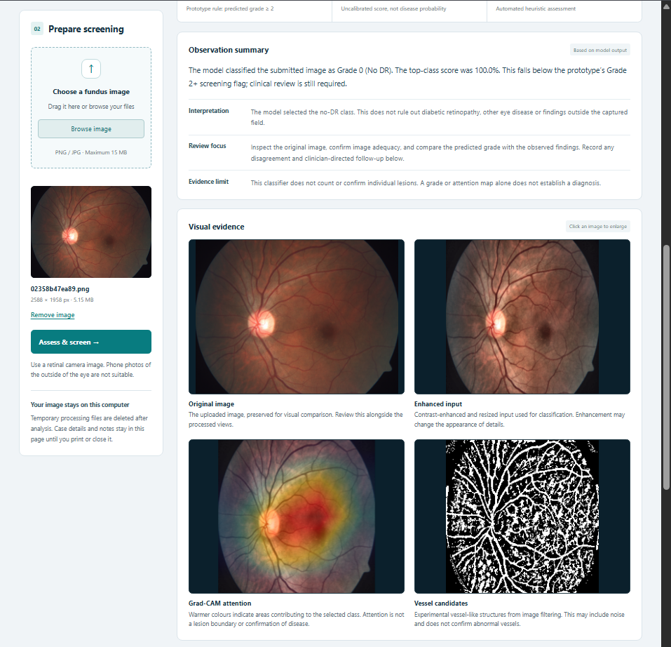
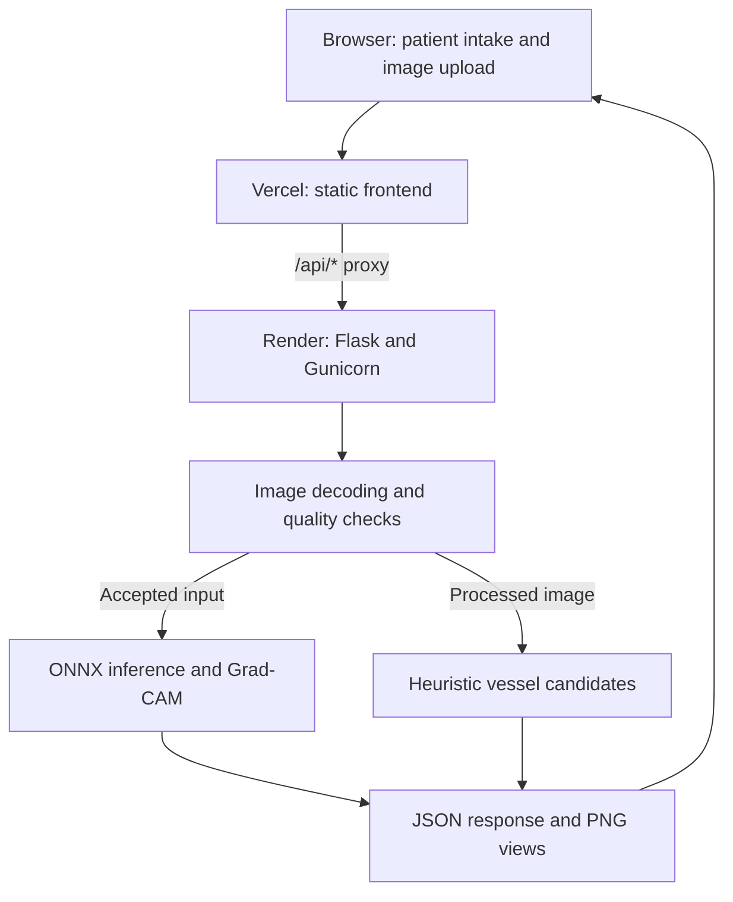

<div align="center">

# RetinaBridge

### Explainable retinal image screening — from MATLAB training to a live web application

**Patient intake · Five-class DR prediction · Grad-CAM · Vessel candidates · Reviewable reports**

[Open Live Demo](https://retina-bridge.vercel.app/) · [Deployment Source](https://github.com/SOLANKYYY/RetinaBridge/tree/deploy-onnx) · [MATLAB Training Source](https://github.com/SOLANKYYY/RetinaBridge/tree/main/matlab)

</div>

---

> **Research and demonstration prototype.** RetinaBridge generates experimental model predictions for human review. It is not a clinically validated diagnostic system. Grad-CAM is an explanation of model behaviour, and the vessel mask is heuristic image processing—not confirmed lesion evidence or validated anatomical segmentation.

## Application Preview



*Example screening interface with observation summaries and four image views. Grad-CAM shows model attention; vessel candidates are heuristic and are not validated segmentation. The displayed model score is not a measure of overall accuracy.*

## Table of contents

- [Overview](#overview)
- [Why this project was built](#why-this-project-was-built)
- [Current features](#current-features)
- [Architecture and technology](#architecture-and-technology)
- [Screening workflow](#screening-workflow)
- [Understanding the four image views](#understanding-the-four-image-views)
- [Model training and experiments](#model-training-and-experiments)
- [Moving from MATLAB to ONNX](#moving-from-matlab-to-onnx)
- [Grad-CAM implementation](#grad-cam-implementation)
- [Validation and results](#validation-and-results)
- [Repository branches and structure](#repository-branches-and-structure)
- [Run locally](#run-locally)
- [Deployment: Render backend and Vercel frontend](#deployment-render-backend-and-vercel-frontend)
- [API reference](#api-reference)
- [Data handling and access](#data-handling-and-access)
- [Testing and troubleshooting](#testing-and-troubleshooting)
- [Limitations and next steps](#limitations-and-next-steps)
- [Project credits and references](#project-credits-and-references)

## Overview

RetinaBridge is a web-based research prototype for diabetic retinopathy screening from fundus photographs. It brings patient intake, image assessment, model prediction, visual explanations, and reviewer observations into one workflow.

The project began as a local MATLAB application connected to a Python HTTP bridge. The trained network was then exported to ONNX so the deployed backend could perform inference without a MATLAB installation or MATLAB Compiler. The frontend is hosted on Vercel, while Python inference runs on Render.

The model predicts one of five classes:

| Grade | Model class label |
|---|---|
| 0 | No DR |
| 1 | Mild |
| 2 | Moderate |
| 3 | Severe |
| 4 | Proliferative |

These are **predicted class labels**, not independently confirmed diagnoses. The interface uses predicted grade **2 or above** as an experimental referable-category flag. This rule is part of the prototype, not a substitute for clinical referral decisions.

### Live application

| Component | Location |
|---|---|
| Public frontend | [retina-bridge.vercel.app](https://retina-bridge.vercel.app/) |
| Model backend | [retinabridge.onrender.com](https://retinabridge.onrender.com/) |
| Backend readiness | [Render health check](https://retinabridge.onrender.com/healthz) |
| Frontend-to-backend status route | [Vercel API status](https://retina-bridge.vercel.app/api/status) |
| Active deployment branch | [`deploy-onnx`](https://github.com/SOLANKYYY/RetinaBridge/tree/deploy-onnx) |

The deployment was completed and reported working during project setup. Hosting availability can change. On the Render free instance used for the demonstration, the backend can sleep during inactivity; opening the frontend does not guarantee the model server is already awake.

## Why this project was built

A model prediction alone is not a complete screening workflow. A useful demonstration also needs an adequate image, relevant patient context, understandable output, and a way for a reviewer to record observations.

RetinaBridge was developed in the context of an SIH project brief on explainable diabetic retinopathy screening for rural settings. Its engineering objectives are:

1. **Make trained-model inference accessible through a browser.** A visitor should not need to install MATLAB or run a notebook.
2. **Present more than a predicted number.** The interface shows quality observations, processed images, model attention, and explanatory text.
3. **Collect patient context before screening.** Intake helps organise the review and report, while keeping clear that the image model does not use the entered history.
4. **Support human review.** Reviewers can compare views, enter notes, choose a disposition, and print a report.
5. **Separate training from deployment.** MATLAB remains the training environment; ONNX provides a portable inference artifact.
6. **Keep the architecture understandable.** Static frontend files, a small Python backend, and a versioned model make the project easier to inspect and extend.

The project demonstrates this workflow. It does not establish rural clinical effectiveness, diagnostic superiority, or deployment readiness for real patient care.

## Current features

### Patient intake

The form captures:

- Patient name or alias and case reference.
- Age, gender, optional contact information, and selected eye.
- Diabetes status and years since diagnosis.
- Hypertension and previous DR history.
- Last eye examination and previous treatment.
- Visual symptoms and additional history notes.
- Consent or authorised demonstration confirmation.

The form checks required fields and some consistency conditions, such as diabetes duration not exceeding age. It does not provide comprehensive medical validation of the entered history.

**Patient details are not model inputs.** The classifier receives the processed retinal image only.

### Image upload and quality review

- PNG and JPEG selection, drag-and-drop, preview, and replacement.
- Minimum image dimensions of 224 × 224 pixels.
- Maximum accepted upload size of 15 MiB at the application layer.
- Maximum decoded image size of 25 million pixels.
- Experimental brightness, focus, and nonblack-coverage checks.
- Recapture feedback when quality thresholds are not met.

Proxy or hosting limits may impose additional constraints. Ordinary photographs and external eye photos are not suitable fundus inputs; the heuristic quality gate does not reliably verify retinal identity.

### Prediction, explanations, and reporting

- Five-class prediction using the exported ResNet-18-based model.
- Top-class softmax score, labelled as uncalibrated.
- Predicted-grade-based screening flag.
- Four visual views for accepted scans: original, enhanced input, Grad-CAM attention, and vessel candidates.
- Click-to-enlarge image views.
- Generated observation summaries and quality measurements.
- Reviewer name, notes, and disposition.
- Browser printing and Save as PDF.

The generated descriptions are based on returned fields and predefined text. No language-model API writes the observations or interprets the images.

## Architecture and technology



Rejected images receive recapture feedback and no predicted grade or class heatmap. Patient intake fields remain in the browser and are attached to the displayed/printed report there.

| Technology | Role | Reason for using it |
|---|---|---|
| HTML, CSS, JavaScript | Frontend and report interface | Lightweight browser UI without a framework build step |
| Python 3.12 | Backend runtime | Runs image handling and ONNX inference |
| Flask | HTTP endpoints and local asset serving | Small application structure with explicit routes |
| Gunicorn | Hosted Python application server | Runs Flask on Render |
| ONNX | Exported network format | Carries the trained network outside MATLAB |
| ONNX Runtime | CPU inference | Executes the exported graph on the server |
| ONNX Python package | Graph inspection and feature-output exposure | Makes the verified final feature tensor available for explanation |
| NumPy | Tensor preparation and Grad-CAM calculations | Handles numeric arrays and classifier-head calculations |
| Pillow | Image decoding and PNG encoding | Validates uploads and prepares returned images |
| OpenCV | Enhancement and vessel filtering | Implements the Python image-processing candidate |
| MATLAB and toolboxes | Training, original preprocessing, reference predictions | Original development and evaluation environment |
| Vercel | Frontend hosting and API forwarding | Serves the public site and forwards model requests |
| Render | Persistent application process | Hosts the Python service and loaded model |

No React, Next.js, PostgreSQL, MongoDB, external AI API, or MATLAB Runtime is required for the current deployed ONNX application.

## Screening workflow

1. **Enter patient details.** Complete the intake form and demonstration/consent confirmation.
2. **Choose a fundus image.** The browser checks basic type, dimensions, and size, then shows a preview.
3. **Submit the image.** JavaScript sends the raw file bytes to `/api/screen` on the frontend domain.
4. **Forward to Render.** Vercel rewrites the request to the corresponding backend endpoint.
5. **Validate and preprocess.** The backend decodes RGB pixels, computes quality measurements, resizes, enhances contrast, and smooths the image.
6. **Apply the quality gate.** Failed quality checks suppress the grade and class heatmap.
7. **Run inference.** An accepted image enters the already loaded ONNX model; the largest output score selects the class.
8. **Generate visual evidence.** The backend computes model attention and experimental vessel candidates.
9. **Review the report.** The browser displays results alongside intake details. A human reviewer adds observations.
10. **Print or save.** The browser generates the printed report or PDF through its print dialog.

The model is loaded once per Python process, rather than starting MATLAB for each scan. The current service permits one active screening request per process and returns a busy response for overlapping scans.

## Understanding the four image views

| View | What it shows | What it does not establish |
|---|---|---|
| Original image | Uploaded photograph for visual reference | Image adequacy or a confirmed diagnosis |
| Enhanced input | Resized, contrast-enhanced RGB image used by the classifier | Recovery of details absent from the original image |
| Grad-CAM attention | Coarse positive contributions to the selected class logit | A lesion mask, lesion boundary, or proof of disease |
| Vessel candidates | Vessel-like structures identified by green-channel filtering | Validated vessel anatomy or detection of abnormal vessels |

### Enhanced input

The Python implementation resizes to 224 × 224, converts to Lab colour space, enhances the lightness channel using CLAHE, applies light Gaussian smoothing, and converts back to RGB.

The method follows the original MATLAB processing design, but library implementations differ. Interpolation, colour conversion, histogram clipping, and rounding mean the two enhanced images are not identical. This difference is explicitly measured during migration checks.

### Vessel candidates

The vessel view uses the enhanced green channel, a disk-radius-5 morphological black-hat operation, a local threshold, and exclusion of dark background pixels.

It is an approximate implementation of the original MATLAB heuristic. Noise and non-vessel dark structures can appear in the mask. It is not trained on vessel annotations and is not a lesion detector. A future supervised segmentation model requires its own annotated dataset and evaluation.

## Model training and experiments

The original training and experiment scripts are preserved on the [`main` branch](https://github.com/SOLANKYYY/RetinaBridge/tree/main/matlab). They are not all present in the deployment branch.

### Data organisation

The baseline loader expects an APTOS-style directory:

```text
aptos2019/
    train.csv
    train_images/
        <id_code>.png
```

`train.csv` must contain `id_code` and `diagnosis`, with grade labels from 0 through 4. The loader checks file existence, valid grades, and Git LFS pointer files masquerading as image data.

Use actual dataset images obtained under the dataset's access conditions. The web deployment does not need the training dataset; it needs the selected model artifact.

### Baseline transfer learning

`train_dr.m` starts from pretrained ResNet-18 and replaces its original classifier with a five-output layer named `dr_fc` and a DR classification output named `dr_output`.

The script specifies:

| Setting | Configured value |
|---|---|
| Random seed | 42 |
| Split | Approximately 70% training, 15% validation, 15% test |
| Split method | Randomised, class-stratified at image level |
| Optimizer | Adam |
| Initial learning rate | `1e-4` |
| Mini-batch size | 16 |
| Default maximum epochs | 12; caller can override |
| Augmentation | Horizontal reflection and rotation from −15° to +15° |
| Class weighting | Inverse-frequency weights from the training labels |
| Saved output | `models/dr_model.mat`, with network and split metadata |

These are **source-code settings**, not a claim that every experiment completed exactly 12 epochs. Image-level splitting does not prove that different images from the same patient cannot appear across partitions.

### Focused fine-tuning

`train_dr_improved.m` starts from a saved baseline and reuses its partitions. It checks that image IDs do not overlap across splits.

The configured experiment trains learnable parameters in the final `res5b` residual block and `dr_fc`, with Adam at `1e-5`, mini-batches of 16, validation-loss selection, and validation patience of four. Batch-normalization running statistics can still adapt; this is not a complete freeze of every earlier network state.

The experiment saves a separate `dr_model_candidate.mat`, checkpoints, training information, and validation comparisons. It does not automatically overwrite the active model. At the repository snapshot reviewed during migration, the active MATLAB model and this improved candidate had the same Git blob hash.

### Head-only LoRA experiment

`train_dr_lora.m` implements a separate head-only low-rank adaptation experiment. It caches frozen backbone features, keeps the original bias, and trains low-rank matrices for the classifier weight update using Adam. The default rank is 2, default learning rate is `1e-4`, and default maximum epoch count is 30 with early stopping.

The merged export remains a standard classifier network. A separate activation helper can back up and replace the active model explicitly.

LoRA was an experiment, not an automatic improvement: the recorded validation comparison showed lower accuracy and sensitivity than its baseline. The deployed model is not presented as the LoRA export.

## Moving from MATLAB to ONNX

### Why the original deployment approach changed

The first Python bridge called `matlab -batch screen_image` for each request. This required a working MATLAB installation, toolboxes, and an appropriate license on the machine doing inference. Hosting the frontend alone could not execute that model.

The revised approach exports the trained network once and runs it using ONNX Runtime. MATLAB Compiler and server-side MATLAB are not required for this route. Training and reference evaluation can still be performed in MATLAB.

### Export performed

The model was inspected in MATLAB R2026a. It loaded as a `DAGNetwork` with a 224 × 224 × 3 input, Z-score normalization, and classes 0–4.

The export workflow was:

```matlab
S = load('C:\path\to\models\dr_model.mat', 'net');
netForExport = dag2dlnetwork(S.net);
onnxPath = 'C:\path\to\models\dr_model.onnx';
exportONNXNetwork(netForExport, onnxPath);
```

The **Deep Learning Toolbox Converter for ONNX Model Format** add-on was installed when MATLAB requested it. Export does not retrain the model. It creates another artifact while preserving the `.mat` source.

### Deployed artifact contract

| Property | Inspected value |
|---|---|
| Model file | `models/dr_model.onnx` |
| File size | 44,786,754 bytes, approximately 44.8 MB |
| ONNX opset | 14 |
| Input name | `data` |
| Input layout | NCHW: `[batch, 3, 224, 224]` |
| Input dtype | Float32 |
| Input range | RGB values in 0–255 units |
| Output name | `prob` |
| Output shape | `[batch, 5]` |
| Output meaning | Five softmax scores in class order 0–4 |
| Execution provider | CPUExecutionProvider |

SHA-256:

```text
4c068e7289376f56c72d34ac6d5c56c905ae12be23c850b2fbdf36748af819de
```

**Normalization is already embedded in the ONNX graph.** Python transposes the enhanced uint8 RGB array and converts it to float32; it does not divide by 255 or apply Z-score normalization again.

Replacing the model is not a file-only update. The current code checks this hash because its explanation implementation is specific to the inspected graph. A different model requires inspection of tensor layout, normalization, class order, and explanation-layer compatibility before updating that guard.

## Grad-CAM implementation

The inspected network ends with:

```text
res5b_relu → global average pooling → linear classifier → softmax
```

Its final feature tensor has shape **512 × 7 × 7**. Python exposes this tensor as an additional ONNX output in memory; the on-disk model weights are not modified.

For class logit `z_c`, global average pooling followed by a linear head gives:

```text
z_c = sum_k W[k,c] × mean(A[k,:,:]) + b[c]
d(z_c) / d(A[k,i,j]) = W[k,c] / 49
```

The derivative can therefore be calculated exactly for this particular head without a separate automatic-differentiation framework. The implementation averages the analytical gradients, forms their weighted feature combination, applies ReLU, and resizes the normalized positive map for display.

This is **analytic logit Grad-CAM**, equivalent to normalized CAM for this architecture. The target is the selected class's pre-softmax logit. It is not a generic explanation implementation for arbitrary ONNX networks and is not claimed to reproduce MATLAB's default Grad-CAM map pixel-for-pixel.

Additional checks:

- The feature tensor and classifier weights must reconstruct the returned softmax scores.
- A map without positive contributions remains uncoloured.
- Quality-rejected images receive no class heatmap.
- The explanation code is tested against finite-difference gradients.

## Validation and results

Three different kinds of evidence must be kept separate: historical classifier evaluation, export agreement, and software functionality.

### Historical MATLAB evaluation: unresolved discrepancy

Two committed files in the original training branch disagree:

| Source | Images | Five-class accuracy | Referable sensitivity | Referable specificity |
|---|---:|---:|---:|---:|
| `models/evaluation.json` | 548 | 82.48% | 88.79% | 95.08% |
| Improved-run `candidate_test_results.csv` | 548 | 82.48% | 90.13% | 95.08% |

The first reports 198 true positives and 25 false negatives; the second reports 201 true positives and 22 false negatives. The JSON records `targetsMet: false`.

These are historical recorded outputs, not independently rerun measurements for the deployed Python pipeline. The discrepancy needs reconciliation using a fixed model hash, test partition, preprocessing implementation, and referral definition. Neither row should be advertised as validated production performance.

### MATLAB-to-ONNX comparison on identical pixels

Two reference samples were exported from MATLAB and compared locally. Each comparison used the exact MATLAB-enhanced PNG as ONNX input before separately testing the Python enhancement.

| Check | Sample A | Sample B |
|---|---:|---:|
| MATLAB predicted grade | 0 | 3 |
| Python pipeline predicted grade | 0 | 3 |
| Maximum MATLAB vs ONNX score error, identical input | `4.63e-12` | `1.79e-7` |
| Export numerical closeness check | Passed | Passed |
| Mean enhancement pixel difference, 0–255 scale | 4.083 | 4.508 |
| Largest full-pipeline score difference | `2.50e-7` | 0.02392 |
| Quality decision | Both accepted | Both accepted |

For Sample B, the selected Grade 3 score changed from approximately **87.73% in MATLAB to 88.89% in Python**. The largest difference across all five class scores was about **2.39 percentage points**.

These two checks support basic export correctness and same-grade behaviour on those samples. Their ground-truth diagnoses were not established by the comparison output. They do not prove full-dataset accuracy, clinical sensitivity, preprocessing equivalence, or explanation quality.

A displayed **100.0%** score can simply be a near-one softmax value rounded to one decimal place. It does not mean the classifier has 100% accuracy or the prediction is certain.

### Software checks

Ten backend/explanation test cases passed during implementation. They cover runtime startup, routes, upload validation, rejected-image behaviour, concurrency handling, the authentication code path, unchanged model scores, analytical gradients, class-specific attention, and synthetic vessel-mask behaviour.

The public deployment subsequently disabled the default password requirement. The retained authentication test exercises the optional code path by patching the password value; it does not imply that the public site requires a login.

Python and JavaScript syntax checks also passed. The deployed application was exercised through the website during setup. These checks are engineering evidence, not a clinical validation study.

## Repository branches and structure

| Branch | Purpose |
|---|---|
| `main` | Original MATLAB project, training scripts, checkpoints, and historical outputs |
| `deploy-onnx` | Flask/ONNX service, current frontend, comparison helpers, and hosting configuration |

**Clone `deploy-onnx` to run the current website.** These branches were created with separate histories during migration. Do not assume an ordinary merge between them will work; preserve training artifacts and review any deliberate history reconciliation.

Deployment branch:

```text
server.py                       Flask routes, origin checks, public-demo access
inference.py                    ONNX inference, enhancement, Grad-CAM, vessel mask
requirements.txt                Python dependencies
.python-version                 Python version selection
Procfile                        Gunicorn hosting command
.gitignore                      Local environments and sample exclusions
compare_sample.py               MATLAB/Python comparison utility
test_backend.py                 HTTP and upload checks
test_explanations.py            Model explanation checks
models/
    dr_model.onnx               Selected deployment model
matlab/
    preprocess_fundus.m         Original reference preprocessing
    export_validation_sample.m  Exports paired validation files
web/
    index.html                  Intake, screening, review, and report markup
    style.css                   Layout, responsive styling, and print styles
    app.js                      Browser interaction and result rendering
    vercel.json                 Static hosting and Render API proxy
README.md                       Project documentation
```

## Run locally

### Requirements

- Git.
- Python 3.12.
- An internet connection for the initial dependency installation.
- The model file included on `deploy-onnx`.

MATLAB, a GPU, and the training dataset are **not needed for local ONNX inference**.

### Windows PowerShell

```powershell
git clone --branch deploy-onnx --single-branch https://github.com/SOLANKYYY/RetinaBridge.git
cd RetinaBridge
py -3.12 -m venv .venv
.\.venv\Scripts\python.exe -m pip install -r requirements.txt
.\.venv\Scripts\python.exe server.py
```

Open **http://127.0.0.1:5000**. Keep the terminal open and press Ctrl+C to stop the app. Calling the virtual environment's Python directly avoids needing to change PowerShell execution policy or activate a script.

If `py` is unavailable but `python --version` shows Python 3.12, use `python -m venv .venv` instead.

### Linux or macOS

```bash
git clone --branch deploy-onnx --single-branch https://github.com/SOLANKYYY/RetinaBridge.git
cd RetinaBridge
python3.12 -m venv .venv
.venv/bin/python -m pip install -r requirements.txt
.venv/bin/python server.py
```

Package availability depends on the operating system and architecture. The recorded development checks used Linux CPU inference; Windows execution was confirmed during project setup. Other environments should be tested independently.

### Local configuration

Leave `PUBLIC_ORIGIN` unset when using the local site so it can validate against its own origin. If it was previously set in the same PowerShell session, clear it:

```powershell
Remove-Item Env:PUBLIC_ORIGIN -ErrorAction SilentlyContinue
```

Start from the folder containing `server.py`. Do not run `index.html` as a standalone file: the page needs the Python API. `python server.py` provides the development server; hosted deployments use Gunicorn.

## Deployment: Render backend and Vercel frontend

### Render backend

| Setting | Value |
|---|---|
| Repository | `SOLANKYYY/RetinaBridge` |
| Branch | `deploy-onnx` |
| Root directory | Repository root; leave blank in Render |
| Runtime | Python 3.12 |
| Build command | `pip install -r requirements.txt` |
| Health-check path | `/healthz` |

Start command:

```bash
python -m gunicorn server:app --bind 0.0.0.0:$PORT --workers 1 --threads 4 --timeout 120
```

Environment configuration for the current public frontend:

```text
PUBLIC_ORIGIN=https://retina-bridge.vercel.app
```

Do not add a trailing slash or page path. `PORT` is supplied by the hosting environment. The current code sets the password to an empty value for public demonstration, so `DEMO_PASSWORD` is not required and an old environment value is ignored.

Use one worker initially. The processing lock is per process, and additional workers would each load their own model. Instance capacity should be chosen from observed RAM, latency, and request volume rather than model-file size alone.

### Vercel frontend

| Setting | Value |
|---|---|
| Repository | `SOLANKYYY/RetinaBridge` |
| Production branch | `deploy-onnx` |
| Application/framework preset | Other |
| Root directory | `web` |
| Build command | Empty |
| Install command | Empty |
| Output directory | `.` |
| Frontend environment variables | None required for this configuration |

If the import flow initially selects `main`, change the project's Production branch tracking to `deploy-onnx`, then create a deployment from that branch. A successfully built `main` frontend can still fail scans because it lacks the deployment branch's API proxy configuration.

The file `web/vercel.json` contains the external rewrite:

```json
{
  "source": "/api/:path*",
  "destination": "https://retinabridge.onrender.com/api/:path*"
}
```

It also configures static output and disables caching for API routes. The browser continues to call relative `/api/...` URLs on Vercel; Vercel forwards those requests to Render. Python executes on Render, not inside a Vercel Function.

Because browser requests remain on the frontend origin, this configuration does not require broad cross-origin CORS permissions. Render still checks the incoming POST Origin against `PUBLIC_ORIGIN`.

### When a domain changes

- If the frontend domain changes, update Render's `PUBLIC_ORIGIN` and redeploy the backend.
- If the backend domain changes, update the destination in `web/vercel.json` and redeploy the frontend.
- Use the stable production frontend URL for scans. Preview URLs will not match the configured production origin unless deliberately supported.
- Opening the Render-served frontend directly may fail POST origin checks when only the Vercel origin is configured. Use the Vercel URL for the public workflow.

### Publishing updates and adding the GitHub website link

After saving a changed file locally:

```powershell
git pull --ff-only origin deploy-onnx
git add README.md
git commit -m "Update RetinaBridge documentation"
git push origin deploy-onnx
```

If Git reports local changes blocking the pull, preserve or commit them and resolve the difference; do not discard them blindly. Stage the actual files you edited for code updates. Connected hosting services can redeploy from changes to their tracked branch.

In GitHub, open the repository's **About** settings and set Website to `https://retina-bridge.vercel.app/`.

## API reference

### `GET /healthz`

Direct backend readiness endpoint. A healthy process has loaded the model and completed its startup inference smoke check.

```json
{"ready": true, "runtime": "onnxruntime"}
```

The Vercel rewrite covers `/api/*`, not `/healthz`; use the Render URL for this health endpoint.

### `GET /api/status`

```json
{
  "model": true,
  "runtime": "ONNX Runtime CPU",
  "migration_validated": false
}
```

`migration_validated: false` remains intentional: two successful paired samples do not establish complete migration validation.

### `POST /api/screen`

- Body: raw JPEG or PNG file bytes.
- Content-Type: `application/octet-stream`.
- Origin: must match the expected frontend origin.
- Do not send JSON or multipart form data to the current implementation.

Principal response fields:

| Field | Meaning |
|---|---|
| `quality` | Focus, brightness, coverage, acceptance, and feedback |
| `grade` | Integer 0–4, or null when no grade is issued |
| `label` | Predicted class name |
| `score` | Top softmax score, or null |
| `enhanced` | Base64 PNG data URL |
| `heatmap` | Grad-CAM overlay data URL, or null |
| `vessels` | Heuristic binary-mask PNG data URL |
| `status` | Processing/review status |
| `note` | Interpretation and migration limitations |
| `attention_method` | Method label when an accepted scan returns attention |

HTTP error codes include `400` for invalid input, `403` for origin mismatch, `413` for excessive upload size, `429` for an already active scan, and `500` for unexpected processing failures. A quality-rejected but otherwise valid upload returns a normal JSON response with a null grade; it is not interpreted as a negative diagnosis.

## Data handling and access

The current deployment is publicly accessible without a password. Anyone with the link can open the interface and submit an image.

- Patient form values stay in the current browser page and appear in printed/exported reports.
- The screening request sends the image bytes, not the patient history fields.
- Images are processed by the Render backend in memory; the ONNX application does not implement persistent image or report storage.
- There is no patient database, account system, saved case history, or durable clinical audit trail.
- Exported PDFs remain wherever the user saves them. Infrastructure can still maintain operational request logs under provider policies.

**Hosted images leave the user's computer.** Any legacy sidebar wording saying an image stays on the computer describes the earlier local setup and should be corrected in the interface; it is not an accurate description of this hosted architecture.

Use authorised, de-identified demonstration images. A checkbox is not a complete clinical consent-management system. The Origin check prevents accidental browser-origin mismatch; it is not authentication, access control against arbitrary clients, or rate limiting.

## Testing and troubleshooting

### Run software checks

```powershell
.\.venv\Scripts\python.exe -m unittest test_backend test_explanations -v
```

Synthetic test images verify execution and certain mathematical properties. They do not assess vessel accuracy or disease detection on real retinal data.

### Produce a paired MATLAB sample

In MATLAB, set Current Folder to the deployment branch's `matlab` folder and run:

```matlab
export_validation_sample
```

Choose the original active `.mat` model, an authorised fundus image, and an output directory. The helper creates a unique folder with:

```text
original.png
enhanced.png
reference.json
```

`enhanced.png` is the exact MATLAB network input; `reference.json` contains class order, scores, grade, and quality measurements. The helper does not retrain or replace the model.

Compare in PowerShell:

```powershell
.\.venv\Scripts\python.exe compare_sample.py "C:\path\to\sample-folder"
```

Review both `export_close` and full-pipeline differences. Matching labels on a few high-confidence samples are insufficient: include borderline scores, multiple grades, camera domains, and rejected images. Do not commit patient images or private comparison samples to the public repository.

### Common problems

| Symptom | Likely cause and next check |
|---|---|
| Unreadable response / `/api/status` returns 404 on Vercel | Check that Production uses `deploy-onnx`, root is `web`, and `vercel.json` is deployed |
| Scan returns 403 | Set Render `PUBLIC_ORIGIN` to the exact frontend origin and redeploy |
| Frontend opens but inference waits or times out | Check Render wake-up, process logs, proxy timeout, and instance resources |
| Model unavailable or startup fails | Check model path, dependency installation, hash guard, and memory |
| “Model changed” error | A different ONNX file was supplied; inspect its architecture before adapting the explanation code |
| Local port 5000 is occupied | Stop the previous local server before starting this one |
| `exportONNXNetwork` is unrecognised in MATLAB | Install the ONNX converter add-on requested by MATLAB |
| File picker shows no model | Navigate to original `models/`, not `matlab/`; select MATLAB Data file `dr_model` |
| Python `if ...` causes a PowerShell parser error | Edit Python inside `.py` files; run shell commands in PowerShell |
| Busy / 429 response | Wait for the current scan to finish before retrying |
| No Grad-CAM for a rejected image | Expected: a quality-rejected image has no class prediction |
| No coloured attention on an accepted image | The positive class map may be empty; read the returned note |
| Noisy vessel mask | Known limitation of heuristic filtering; do not treat it as validated segmentation |
| Old password prompt | Check latest deployment and test in a fresh browser session |
| LF/CRLF Git warning on Windows | Line-ending conversion notice; it does not itself indicate a failed commit |

## Limitations and next steps

### Current limitations

- Python enhancement is not pixel-equivalent to MATLAB preprocessing.
- Paired migration comparison covers two samples, not the full held-out set.
- Historical sensitivity outputs disagree and need reconciliation.
- No external clinical validation or verified patient-disjoint split is established.
- Softmax scores are not calibrated disease probabilities.
- The quality gate is heuristic and does not reliably distinguish fundus from non-fundus images.
- Resizing to 224 × 224 can discard fine details.
- Grad-CAM is a coarse class-attention map, not lesion segmentation.
- Vessel candidates are noisy heuristics, not a supervised segmentation model.
- The public prototype has no persistent patient records, clinical access roles, distributed queue, or comprehensive abuse controls.
- Hosted latency and availability depend on service resources and cold starts; no throughput guarantee is made.

### Proposed next work

1. Expand paired MATLAB/ONNX comparisons and measure changes near decision boundaries.
2. Reconcile historical evaluation outputs and rerun the selected Python pipeline on a fixed held-out dataset.
3. Evaluate across camera types and external cohorts with clear exclusion and quality-rejection reporting.
4. Add a trained quality/fundus-identity model.
5. Train and assess vessel and lesion segmentation using appropriate pixel-level annotations.
6. Explore higher-resolution or patch-based processing for fine detail.
7. Calibrate scores on validation data and assess calibration on untouched test data.
8. Evaluate explanation usefulness with qualified reviewers.
9. Add durable records, consent management, role-based access, retention policies, and audit logs if the scope expands beyond demonstration.
10. Measure memory and latency, then add job management and capacity appropriate to observed demand.

These items are a roadmap, not implemented capabilities.

## Project credits and references

**Project author:** [Solanki Om Narendra — SOLANKYYY](https://github.com/SOLANKYYY)

**Academic context:** B.Tech CSE–AIML, Jain (Deemed-to-be University). Developed as an SIH-oriented research and engineering prototype.

The work combines original project implementation with pretrained-model transfer learning, MATLAB tooling, ONNX deployment, and standard open-source image-processing libraries. Dataset access conditions and third-party software licenses remain applicable; this README does not grant a new license to code, data, or model weights.

References:

- [Original MATLAB training scripts](https://github.com/SOLANKYYY/RetinaBridge/tree/main/matlab)
- [Current deployment source](https://github.com/SOLANKYYY/RetinaBridge/tree/deploy-onnx)
- [MATLAB DAGNetwork conversion](https://www.mathworks.com/help/deeplearning/ref/dag2dlnetwork.html)
- [MATLAB ONNX export](https://www.mathworks.com/help/deeplearning/ref/exportonnxnetwork.html)
- [ONNX Runtime Python API](https://onnxruntime.ai/docs/api/python/api_summary.html)
- [Grad-CAM research paper](https://arxiv.org/abs/1610.02391)
- [Render Flask deployment](https://render.com/docs/deploy-flask)
- [Vercel external rewrites](https://vercel.com/docs/routing/rewrites)
- [Vercel deployment environments](https://vercel.com/docs/deployments/environments)
- [APTOS 2019 dataset competition](https://www.kaggle.com/c/aptos2019-blindness-detection)

---

**RetinaBridge demonstrates the complete engineering path from a trained MATLAB network to browser-based inference, visual explanations, and a reviewable report. The next research milestone is broader evaluation of the deployed pipeline.**
